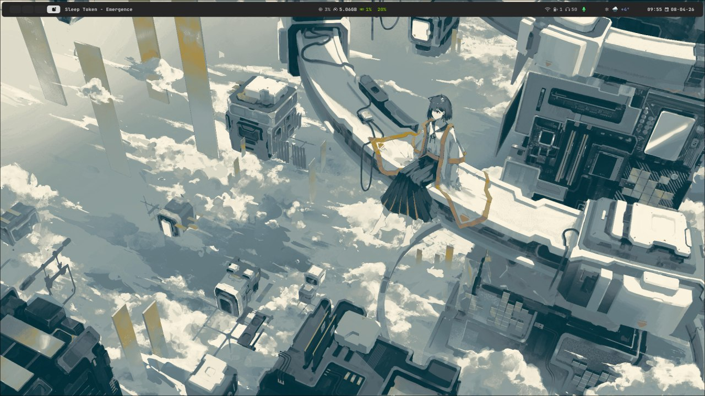
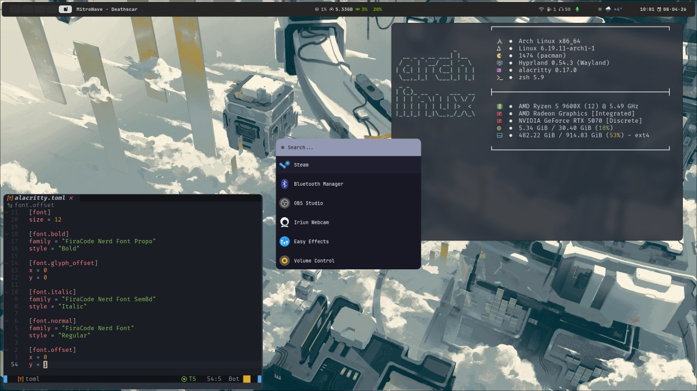
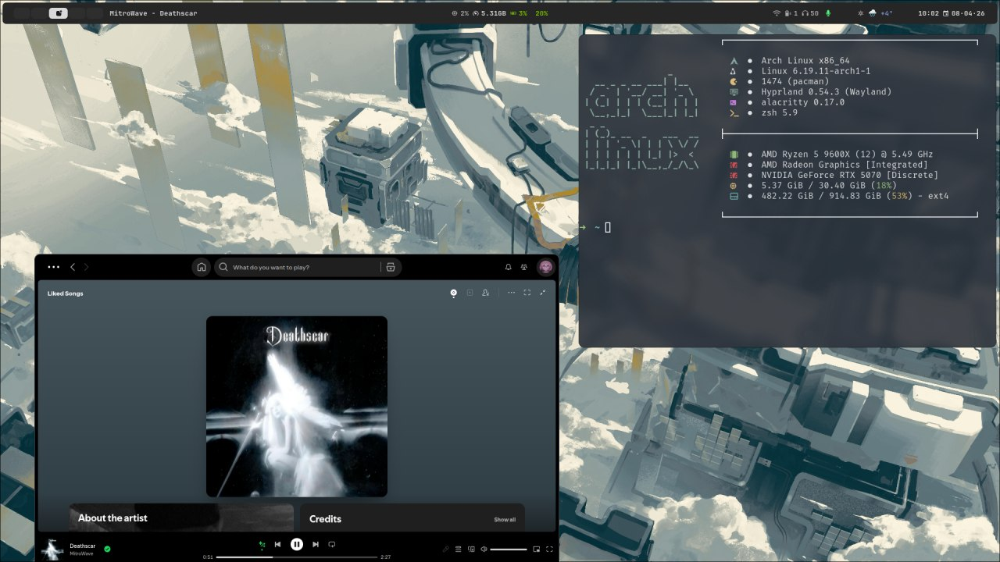

# dotfiles

[](https://hyprland.org/)
[](https://github.com/Alexays/Waybar)
[](https://github.com/hyprwm/hyprlock)
[](https://github.com/alacritty/alacritty)
[](https://github.com/lbonn/rofi)
[](https://github.com/sentriz/cliphist)
[](https://github.com/pwmt/zathura)
[](https://github.com/mortie/swaylock-effects)
[](https://github.com/dunst-project/dunst)
[](https://voxtype.io/)

## Installation

### One-command install

```bash
curl -sL https://raw.githubusercontent.com/redmoondz/dotfiles/main/install.py \
     -o /tmp/install.py && python3 /tmp/install.py
```

The installer will:
1. Install `yay` (AUR helper) if needed
2. Let you choose **Minimal** (~35 packages) or **Full** install
3. Install all packages with `--noconfirm`
4. Copy configs to `~/.config/`
5. Copy wallpapers to `~/Pictures/Wallpapers/`
6. Set up **Voxtype** voice typing (with model download)
7. Configure **SSH** for GitHub (semi-automatic)
8. Set up **Zsh** with Oh My Zsh and plugins

### Advanced installation (manual)

<details>
<summary>Manual step-by-step</summary>

Clone the repository:
```bash
git clone https://github.com/redmoondz/dotfiles.git ~/dotfiles
```

Install required packages:
```bash
sudo pacman -S --needed hyprland hyprpaper hypridle hyprlock waybar konsole alacritty \
    dunst libnotify fastfetch pamixer bash-completion cliphist slurp grim \
    ttf-firacode-nerd ttf-jetbrains-mono-nerd noto-fonts-emoji \
    github-cli libmtp gvfs-mtp android-tools ntfs-3g git curl base-devel zsh

yay -S --needed swaylock-effects-git rofi-lbonn-wayland-git rofi-emoji-git \
    brillo hyprpicker-git voxtype
```

Copy configs:
```bash
cp -r ~/dotfiles/.config/* ~/.config/
cp ~/dotfiles/.zshrc ~/
mkdir -p ~/Pictures/Wallpapers
cp ~/dotfiles/Pictures/Wallpapers/*.jpg ~/Pictures/Wallpapers/
```

Checkout the `main` branch and adjust Hyprland keybindings in `.config/hypr/config/binds/`.

</details>

## Voice typing (Voxtype)

Push-to-talk voice input using local Whisper AI — works offline.

- **Hotkey:** `ScrollLock` (hold to record, release to transcribe)
- **Languages:** English + Russian (large-v3-turbo model)
- **Output:** Types text directly at cursor position
- **Config:** `~/.config/voxtype/config.toml`

The `install.py` script handles model download and service setup automatically.

Manual service control:
```bash
systemctl --user enable --now voxtype   # start and enable on login
systemctl --user status voxtype         # check status
```

## Syncing configs (for development)

To update the repository with your latest system configs:

```bash
python3 sync_configs.py              # sync and push to GitHub
python3 sync_configs.py --dry-run    # preview what will be synced
python3 sync_configs.py --no-push    # sync without pushing
```

## Preview
[preview](https://github.com/sameemul-haque/dotfiles/assets/110324374/3f3ad231-ba5c-42fc-9d01-6466e4550158 "dotfiles preview")

<!--  -->

|  |
| :-------------------------------: |
| _waybar.jpg_ |

|  |
| :-----------------------------------------------: |
| _waybar nvim rofi alacritty.jpg_ |

|  |
| :------------------------------------------: |
| _Floating spotify alacritty.jpg_ |


## Dotfiles are available for the following:
| HYPRLAND | WAYBAR | ROFI | DUNST | HYPRLOCK | SWAYLOCK | ZATHURA | ALACRITTY | KONSOLE | NEOVIM | FASTFETCH | VOXTYPE |
|---|---|---|---|---|---|---|---|---|---|---|---|

## Star History
<picture>
    <source media="(prefers-color-scheme: dark)" srcset="https://api.star-history.com/svg?repos=redmoondz/dotfiles&type=Date&theme=dark" />
    <source media="(prefers-color-scheme: light)" srcset="https://api.star-history.com/svg?repos=redmoondz/dotfiles&type=Date" />
    
</picture>
